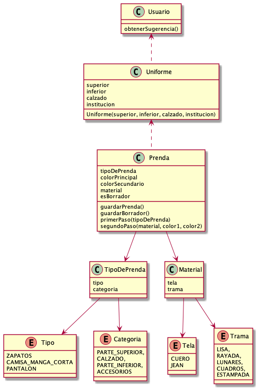

# Que Me pongo

## Diagrama de Clases



## Consigna
QuéMePongo es una empresa dedicada al armado de atuendos adecuados a las condiciones climáticas y preferencias de sus clientes. El servicio que provee se basa en tomar las prendas del guardarropas de une usuarie y generar diferentes combinaciones posibles que cubran las necesidades de les mismes en términos de distintos factores climáticos tales como temperatura, viento, sol, lluvia, etc. Asimismo, se busca que estos atuendos se adecuen de la mejor forma a las sensibilidades particulares respecto de dichos factores de cada usuarie y a sus gustos en el aspecto estético.

### Primera Iteración

[Link](https://docs.google.com/document/d/1k1f-9AuIohlBGB2soSNePJ6jLxM37_tZeSD-hW_esIQ/edit)

### Segunda Iteración

[Link](https://docs.google.com/document/d/10j6XB9zIhl5xox2xBEDEFsgPmueHMkyvLSHcLxl_27Y/edit#heading=h.uyku9mnteh0t)

### Tercera Iteración (Opcional)
[Link](https://docs.google.com/document/d/1th_F_BsF91zKuFWk6POogegljhrVW9ThybW_9U_xJZY/edit#heading=h.uyku9mnteh0t)

### Cuarta Iteración
[Link](https://docs.google.com/document/d/1sy9S9EeIQr8fhatKnfTCgOfjVniJDu2viI-Av0gn0xY/edit)

### Quinta Iteración
[Link](https://docs.google.com/document/d/1wS622pMwZrDK9ilL_hEt5bBE04vKUKZILx8cIQ-aQzU/edit)

### Sexta Iteración
[Link](https://docs.google.com/document/d/1NxqhJj70kt-_4aw-CawlISdJZyedzoOcLAVJAZVZISE/edit)

## Ejecutar tests

```
mvn test
```

## Validar el proyecto de forma exahustiva

```
mvn clean verify
```

Este comando hará lo siguiente:

 1. Ejecutará los tests
 2. Validará las convenciones de formato mediante checkstyle
 3. Detectará la presencia de (ciertos) code smells
 4. Validará la cobertura del proyecto

## Entrega del proyecto

Para entregar el proyecto, crear un tag llamado `entrega-final`. Es importante que antes de realizarlo se corra la validación
explicada en el punto anterior. Se recomienda hacerlo de la siguiente forma:

```
mvn clean verify && git tag entrega-final && git push origin HEAD --tags
```
